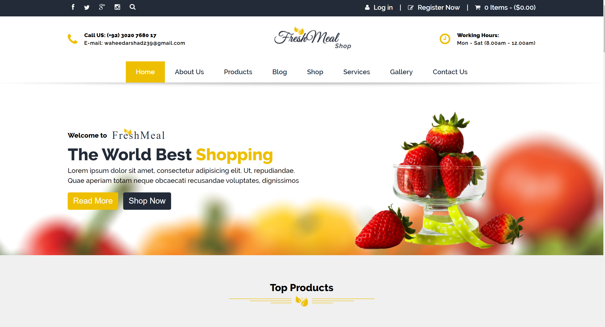
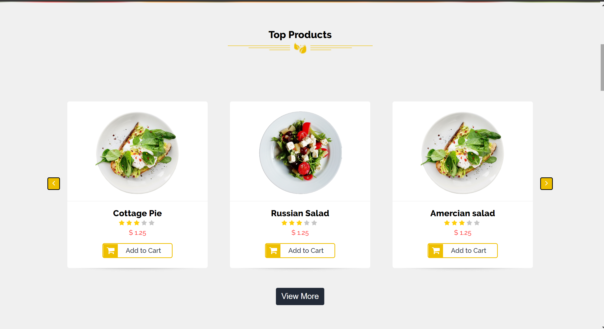
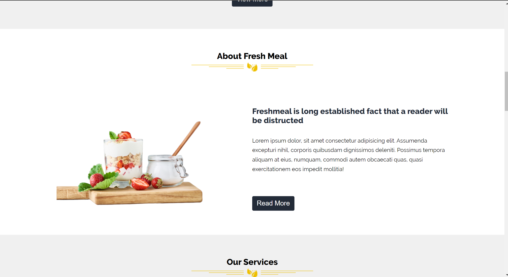
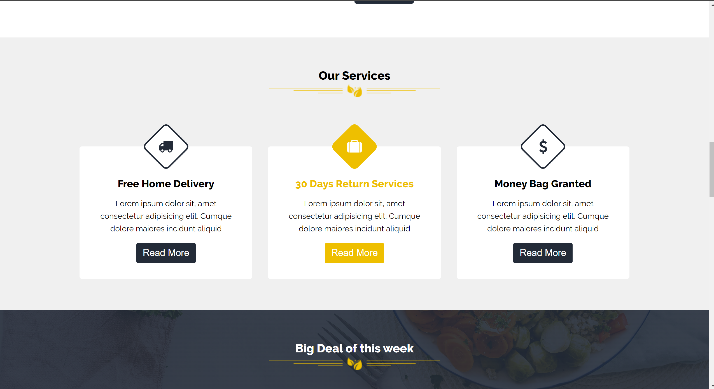
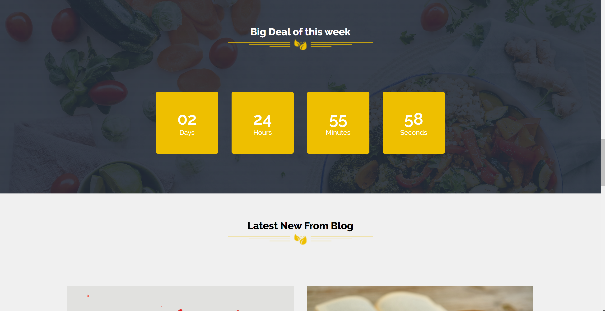
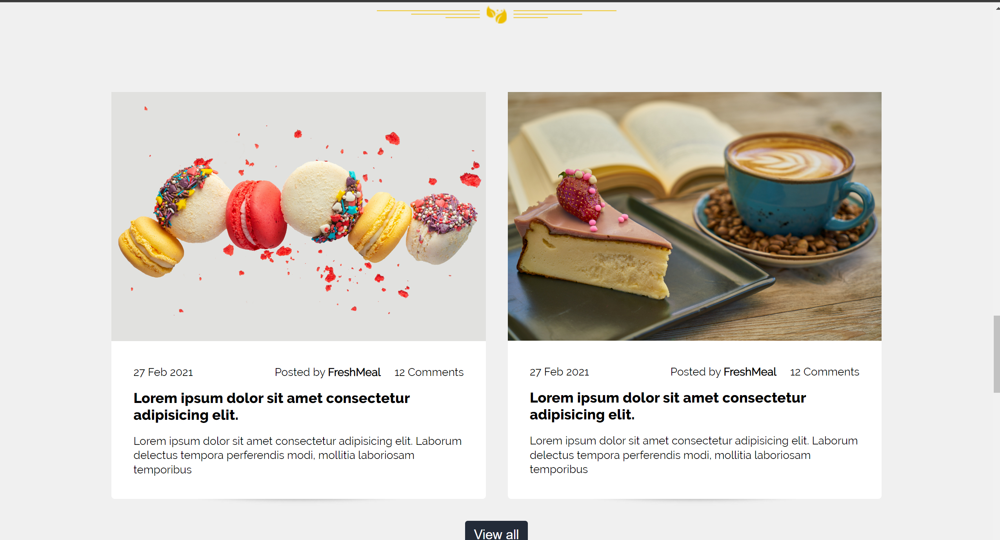
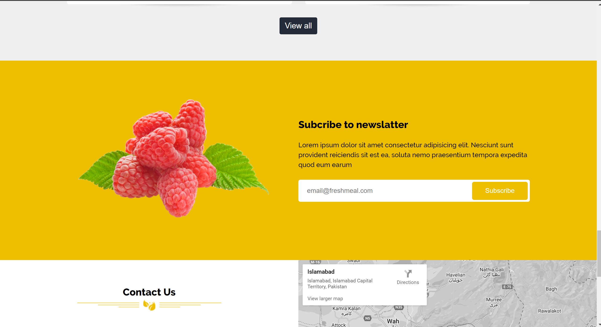
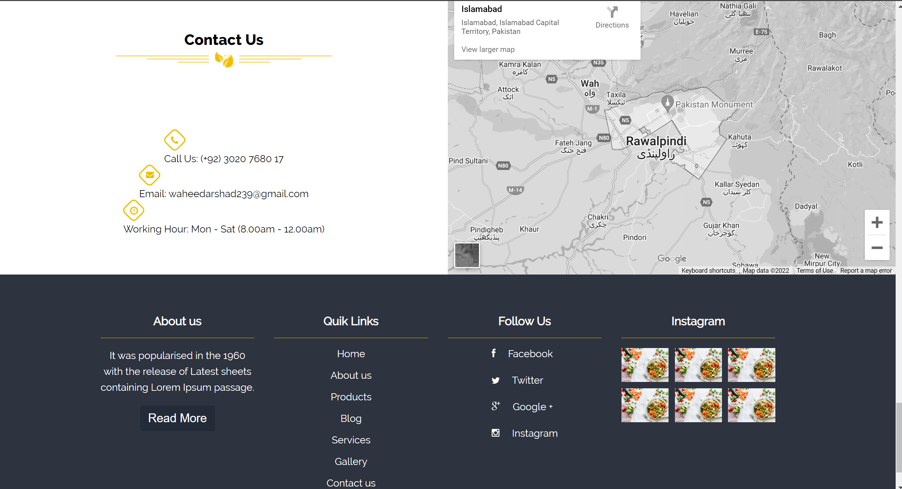

# ecommercewebsite
The *The Fresh Meal Shop* is a ecommerce website.Developed using HTML, CSS and Bootstrap.

-The core idea of the project is to provide a hassle-free website for users to order Food products online. 
The problem with the current websites is that there is a lot of irrelevant features and unnecessary ads. My idea is to build a website that has a simple interface with selected features.
Features of the website:
People can order Food products online.
Products can be added to cart to order multiple items.
There is a page with contact information if there is any issue.
Created an about us page.
Each user have an account.
Can be accessed from mobile too.

## Technologies
- [Bootstrap](https://getbootstrap.com)
- [HTML](https://www.w3schools.com/html/default.asp)
- [CSS](https://www.w3schools.com/css/default.asp)

